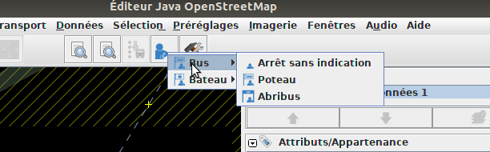
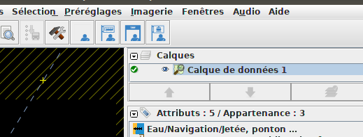

# josm-stop-presets
These presets for JOSM allow to add in one click all main useful tags for public transport stops that have been surveyed with [Jungle Bus osmtracker layout](https://github.com/Jungle-Bus/osmtracker-layouts).

## Install in JOSM

* Edit -> Preferences
* Map Settings
* Tagging presets (third tab)
* Select "Jungle stops"

The presets are now available in JOSM `presets` menu.

For easier access, you can add them as buttons in JOSM interface in
* Edit -> Preferences
* Toolbar customization

For instance:

Or as individual buttons, to add all tags in one click:

If you map a lot of transport items in JOSM, you should also take a look and activate [Jungle Bus validators](https://github.com/Jungle-Bus/transport_mapcss) :wink:

## Credits

This project has been developed by the [Jungle Bus](http://junglebus.io/) team.

The code in this repository is under the GPL-3.0 license.

If you value this work, show your support by donating to the [OSM French local chapter](http://openstreetmap.fr).

